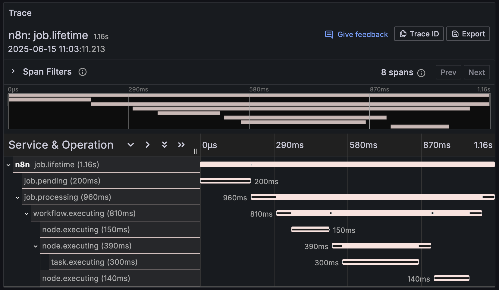

# n8n-tracer


Construct OpenTelemetry traces from n8n event logs.

Experimental! Little learning project to tinker with tracing.

Features:

- Generate OTEL traces from n8n executions in real time
- Listen to log streaming events via HTTP in scaling mode
- Watch `n8nEventLog-{n}.log` files in regular mode
- Export to any OTEL backend: [Jaeger](docs/jaeger.png), [SigNoz](docs/signoz.png), etc.

Sample trace:



## How it works

In scaling mode, `n8n-tracer` listens at `/ingest` for HTTP requests sent by n8n instances via [log streaming](https://docs.n8n.io/log-streaming/), generates OTEL traces from those requests, and exports them to your OTEL backend. Out-of-order events are sequenced correctly.

Trace structure in scaling mode:

```
job.lifetime
├── job.pending
└── job.processing
    └── workflow.executing
        └── node.executing
            └── task.executing
```

In regular mode, `n8n-tracer` watches your `~/.n8n/n8nEventLog-{n}.log` files for changes, generates traces, and exports them to your OTEL backend. Read positions persist across restarts, and logfile rotations are handled automatically.

Trace structure in regular mode:

```
workflow.executing
└── node.executing
    └── task.executing
```

Sample span attributes:

- `job.id`
- `execution.id`
- `workflow.id`
- `node.id`
- `node.type`
- `task.id`
- `host.id` (main, worker, webhook)
- among others

## Getting started

> [!IMPORTANT]
> Requires n8n version `0.100.0` or higher

Run `n8n-tracer` as a sidecar container in your n8n docker compose. Use env vars to configure `n8n-tracer` to receive events from event logs or HTTP requests, and export traces to your OTEL backend.

Sample docker compose:

```yml
services:
  n8n:
    image: n8nio/n8n:latest
    ports:
      - "5678:5678"
    volumes:
      - n8n_data:/home/node/.n8n
    # ...

  n8n-tracer:
    image: ghcr.io/ivov/n8n-tracer:latest
    environment:
      - N8N_DEPLOYMENT_MODE=regular
      - WATCH_FILE_PATH=/n8n-data/n8nEventLog.log
      - OTEL_EXPORTER_OTLP_ENDPOINT=http://jaeger:4318
    volumes:
      - n8n_data:/n8n-data
    # ...

  jaeger: # or SigNoz, Grafana Tempo, etc.
    image: jaegertracing/all-in-one:latest
    ports:
      - "16686:16686"
      - "4318:4318"
    # ...

volumes:
 n8n_data:
```

### Environment variables

| Variable                      | Description                                                                    | Default                 |
| ----------------------------- | ------------------------------------------------------------------------------ | ----------------------- |
| `N8N_DEPLOYMENT_MODE`         | n8n deployment mode, either `regular` or `scaling`                             | **Required**            |
| `OTEL_EXPORTER_OTLP_ENDPOINT` | OTLP HTTP collector endpoint, to export traces to                              | `http://localhost:4318` |
| `N8N_VERSION`                 | n8n version, added to trace metadata                                           | `1.97.0`                |
| `HEALTH_PORT`                 | Health check server port                                                       | `8888`                  |
| `STALE_SPAN_THRESHOLD`        | Max age for unclosed spans                                                     | `24h`                   |
| `SPAN_GC_INTERVAL`            | How often to GC unclosed spans                                                 | `1h`                    |
| `N8N_WORKFLOW_START_OFFSET`   | Dequeue offset, see [event sequencing note](#event-sequencing-in-scaling-mode) | `50ms`                  |

For ingestion via logfiles:

| Variable            | Description                                                        | Default                 |
| ------------------- | ------------------------------------------------------------------ | ----------------------- |
| `WATCH_FILE_PATH`   | Path to n8n's event log file, typically `~/.n8n/n8nEventLog.log`   | **Required**            |
| `STATE_FILE_PATH`   | Path to state file, where read position for log files is persisted | `n8n-tracer.state.json` |
| `DEBOUNCE_DURATION` | How long to wait before processing logfile change events          | `1s`                    |

For ingestion via log streaming:

| Variable           | Description                                                                | Default |
| ------------------ | -------------------------------------------------------------------------- | ------- |
| `HTTP_INGEST_PORT` | Port for tracer's `/ingest` endpoint to receive n8n's log streaming events | `8889`  |

### Event sequencing in scaling mode

In scaling mode, main and worker instances log events like this:

- main logs `n8n.queue.job.enqueued`
- main logs `n8n.workflow.started` ⚠️
- worker logs `n8n.queue.job.dequeued`
- worker logs `n8n.node.started`
- worker logs `n8n.node.finished`
- main logs `n8n.node.workflow.finished`
- main logs `n8n.queue.job.completed`

This order is incorrect, because it is the worker who should log `n8n.workflow.started` and do so after `n8n.queue.job.dequeued`. Constructing a trace following this order would be incorrect, as the `workflow.executing` span would have a longer duration than its `job.processing` parent span.

Hence `n8n-tracer` overrides the start of the `workflow.executing` span to start 50ms (configurable) after `n8n.queue.job.dequeued`, as a workaround until n8n corrects this. For consistency, this offset applies also to any execution retried after a job stalling.

## Development

To set up a local development environment, follow these steps.

0. Clone repo:

```sh
git clone https://github.com/ivov/n8n-tracer.git
```

1. Install deps:

```sh
brew install go lefthook golangci-lint
make githooks
```

2. Set up env vars:

```sh
export N8N_DEPLOYMENT_MODE=regular
export OTEL_EXPORTER_OTLP_ENDPOINT=http://localhost:4318
export WATCH_FILE_PATH=~/.n8n/n8nEventLog.log
```

3. Start up an in-memory OTEL backend:

```sh
docker run --rm --name jaeger -p 16686:16686 -p 4318:4318 jaegertracing/all-in-one:latest
```

4. Make your changes, clear state and run:

```
make clear; make run

2025/06/18 18:42:51 n8n-tracer is starting... Press Ctrl+C to exit
2025/06/18 18:42:51 Configured for OTLP endpoint: http://localhost:4318
2025/06/18 18:42:51 Connected to OTLP endpoint
2025/06/18 18:42:51 Starting initial catch-up scan
2025/06/18 18:42:51 Starting health check server at port 8888
2025/06/18 18:42:51 Starting GC to clear spans older than 24h0m0s every 1h0m0s
2025/06/18 18:42:51 Processed 13 events
2025/06/18 18:42:51 Completed initial catch-up scan
```

5. Run n8n workflows locally, and inspect traces at `http://localhost:16686`

## Release

Publish a GitHub release with a git tag following semver. This will trigger a Docker image build and push it to GHCR.
